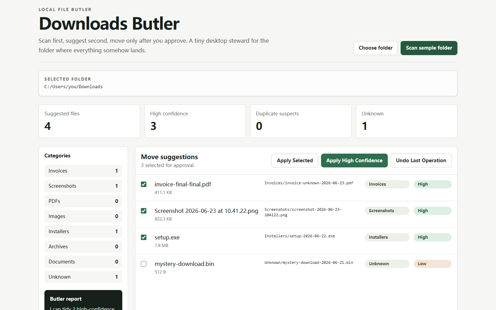

# Downloads Butler 下载文件夹清洁工

Downloads Butler 是一个谨慎型本地桌面整理工具，用来扫描下载文件夹，识别常见文件类型，并在用户确认后把文件移动到更清晰的目录结构中。

它的原则很简单：先扫描、再建议、最后由你决定是否执行。应用不会自动删除文件，也不会在未经确认的情况下移动文件。

## 产品预览



截图使用内置样例文件夹：应用识别出 4 个待整理文件，为 3 个高置信度文件生成分类与重命名建议，并把未知文件保留为未选中状态。

## 工作方式

1. 选择真实目录，或在浏览器预览中扫描样例文件夹。
2. 本地规则根据文件名、扩展名和修改时间生成分类、命名与重复文件提示。
3. 用户逐项确认，或只执行高置信度建议。
4. Tauri 原生端执行移动并记录批次，为撤销操作保留依据。

## 功能特点

- 扫描指定文件夹中的文件，并生成整理建议
- 按规则识别发票、截图、PDF、图片、安装包、压缩包和文档
- 根据文件名、扩展名和修改时间生成建议文件名
- 检测疑似重复文件，并在界面中标记
- 支持选择单个建议、执行高置信度建议或批量执行已选建议
- 通过 Tauri 调用本地文件系统，文件操作保留在本机完成
- 使用 SQLite 记录操作批次，为撤销能力提供基础

## 技术栈

- React 19
- TypeScript
- Vite
- Tailwind CSS
- Tauri 2
- Rust
- SQLite / rusqlite
- Vitest

## 本地开发

先安装前端依赖：

```bash
npm install
```

启动浏览器预览：

```bash
npm run dev
```

启动 Tauri 桌面应用：

```bash
npm run tauri dev
```

运行测试：

```bash
npm test
```

构建前端：

```bash
npm run build
```

构建桌面应用：

```bash
npm run tauri build
```

## 项目结构

```text
.
├── src/                 # React 前端界面和整理规则
│   ├── core/            # 文件分类、重命名建议、重复文件检测
│   ├── App.tsx          # 主界面
│   └── tauriClient.ts   # 前端与 Tauri 命令的连接层
├── src-tauri/           # Tauri / Rust 原生端
│   ├── src/lib.rs       # 扫描、移动、撤销和历史记录逻辑
│   └── tauri.conf.json  # 桌面应用配置
├── package.json
└── vite.config.ts
```

## 安全说明

Downloads Butler 默认只给出建议，不会自动整理你的文件。真正的移动操作需要用户在界面中明确点击执行。

当前版本的整理策略偏保守，适合先作为下载文件夹的本地整理助手使用。重要文件较多时，建议先在测试文件夹中试用，再对真实下载目录执行移动操作。

## 当前状态

项目处于早期版本，核心扫描、分类、建议、移动和测试流程已经搭好。后续可以继续完善更细粒度的规则、历史记录界面、撤销体验和打包发布流程。
